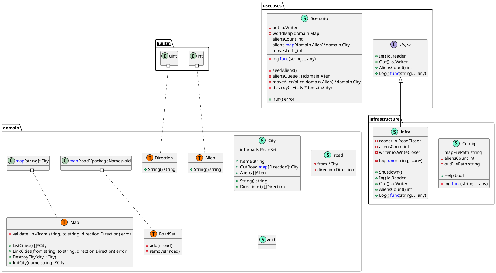
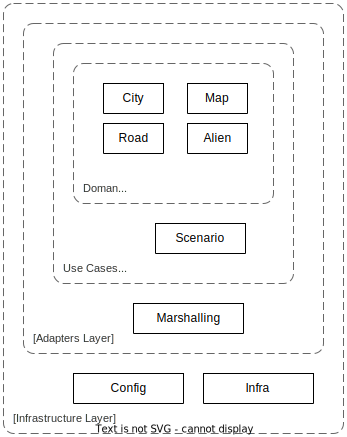

# Alien Invasion. Design and Architecture.

## Functionality design

The assignment leaves certain details of the functionality undefined. Several major decisions are required in
order to implement the application. The main decision principle was to define functionality details that do not
conflict with what was written in the assignment.

### World Map

The assignment document states that each city has 1 to 4 outgoing roads assigned to 4 compass directions.
Here we can make several assumptions

- There is no limit to the number of incoming roads
- Incoming roads have direction from the "source" City but have no defined direction in the "target" City
- First two points lead to the conclusion that World Map can not be an undirected graph, otherwise, there will be a limit on incoming roads number

As a result, World Map will be implemented as a directed graph. Each node of the graph has 1-4 named outgoing links.
The is no limit on incoming links to each node.

### Graph connectivity

The document does not specify if World Map represents a connected graph. Generally, it means that it is possible that World Map
will consist of several isolated City clusters.

### Seeding Aliens

There is no defined behavior when two aliens are randomly placed in the same City on the map at the start of the scenario.

The decision was to avoid situations where random Alien placement results in two Aliens ending up in the same city.

As a result of the previous decision, we introduce a limit on the number of Aliens in the scenario. In order to avoid collisions during
random Alien placement the number of Aliens N must not be greater than the number of Cities on the Map.

### Alien movements

The assignment document does not specify the coordination of the alien's movement.

- Do they move simultaneously (round by round where each alien moves to a neighboring City)?
- Do they move asynchronously?
- Do they move one Aliem at a time?

With 3 listed choices only the last one guarantees that no more than 2 aliens can end up in the same city. The behavior of
more than 2 aliens met in the same City is undefined.

So, the decision is that Aliens move one at a time with all fights between them resolved before the start of the next Alien move.

## The Code Composition

General outline of the code composition is shown on the diagram below.

Aliens are represented as a basic extension of the `int` type. World map extends core `map[string]*City` type.
`Direction` is an `int` enumeration with added `Stringer` functionality.

## Program architecture

In order to facilitate the testability of each module of the program the decision was made to build the program following the "Clean Architecture principle".

The application is built with 4 main layers

1. Domain layer. With the definitions of the main application actors: City, Map, Road
2. Application layer. These are the use cases where the main application logic is implemented. In our application, we have a single use-case Scenario
3. Adapter layer. It is the layer responsible for the representation of entities and use-case states for the outside world. In our case, this is a module responsible for Marshalling and Unmarshalling entities into and from abstract Writer and Reader.
4. Infrastructure layer. The layer that creates an environment for the use-case initialization and execution.

There are several rules of relationship between layers.

- the outer layers have dependencies on internal layers but not vice versa.
- The adapter layer is abstracted from the concrete implementation of the Infrastructure. It makes it possible to apply TDD with test infrastructure implementation.
- SOLID principle

